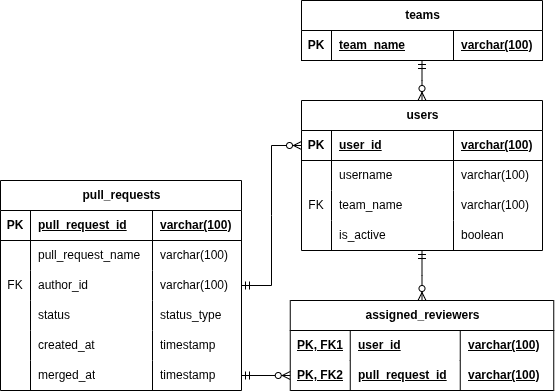
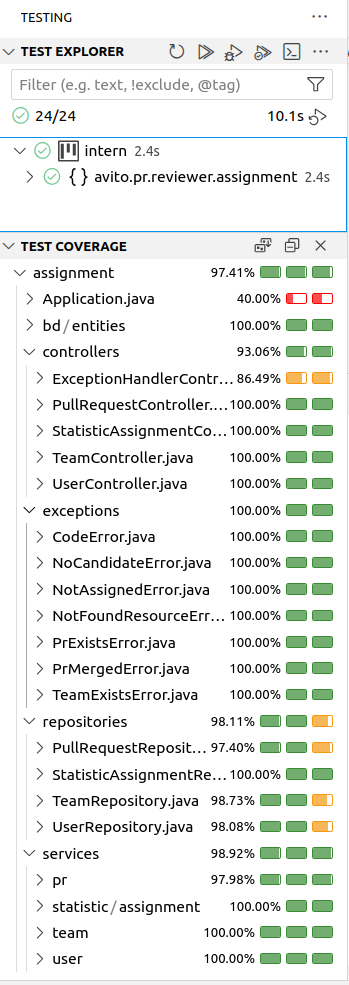

# Тестовое задание для стажёра Backend (осенняя волна 2025)

## Выполнил Стрельбицкий Илья Павлович

### Как запускать код

Для запуска требуется файл `.env` где прописаны нужные переменные окружения, в качестве примера представлен файл `.env.example`, он находится в нужном месте, для его использования достаточно убрать `.example` из названия.

#### Запуск при помощи docker-compose

Для запуска решения доступен запуск при помощи `docker-compose`.

`docker-compose down` - остановка

`docker system prune -a -f` - очистка

`docker-compose up --build` - сборка и запуск

`docker-compose up` - повторный запуск

`docker-compose up app` - запуск только приложения без тестов

`docker-compose up tests` - запуск только тестов

Приложение доступно по `localhost:8080`

#### Запуск без docker-compose

Для запуска требуется чтобы был установлен `jdk` 21 версии.

Для локального запуска без `docker-compose` требуется файл `flyway.conf` чтобы выполнить миграцию БД. В качестве примера представлен файл `flyway.conf.example`.

Есть переменная окружения `SPRING_PROFILES_ACTIVE` которая задает профиль `spring boot`, для обычного запуска нужно прописать профиль `dev`, для запуска тестов `test`. Каждый профиль имеет свою конфигурацию.

Для запуска приложения сначала устанавливаем профиль на `dev`. 
Затем запускаем сервис: 
`"./mvnw" spring-boot:run -f "./pom.xml"`

Для запуска тестов сначала устанавливаем профиль на `test`. 
Затем запускаем тесты: 
`"./mvnw" verify -f "./pom.xml"`

### Комментарии к решению

В решении тестового задания я использую `Java Spring Boot` и `PostgreSQL`, для миграций `Flyway`, для интеграционных тестов `testcontainers`, также для уменьшения boilerplate кода `lombok`.

С учетом умеренной нагрузки на сервис и отсутствия повышенных требований к скорости отклика, использование "медленного" `Spring Boot` вместо "быстрого" `Golang` вполне допустимо.

Также я сделал допущение, что представленные названия эндпоинтов не являются окончательными, поскольку это новый создаваемый сервис, поэтому я заменил их упорядочив и сделав более RESTfull 
**POST: /team/add -> POST: /teams** 
**GET: /team/get -> GET: /teams/{team_name}** 
**POST: /users/setIsActive -> POST: /users/set-is-active** 
**POST: /pullRequest/create: -> POST: /pull-requests** 
**POST: /pullRequest/merge -> POST: /pull-requests/merge** 
**POST: /pullRequest/reassign -> POST: /pull-requests/reassign** 
**GET: /users/getReview -> GET: /users/get-review**

Еще также я добавил в начало всех эндпоинтов `/api/v1`

Я решил использовать `JdbcTemplate` для работы с БД вместо `orm` по типу `hibernate`, поскольку в `Go` чаще используется "ручной" маппинг с написанием нативных `sql` запросов. Но даже в том случае если бы это было не так, и поскольку каждая `orm` сильно отличается и на будущей работе не будет использоваться та которую я применил бы, то лучшей демонстрацией моих навыков оставалось бы использование "ручного" маппинга с написанием нативных `sql` запросов.

Составленная даталогическая модель:

Тестовое покрытие:

